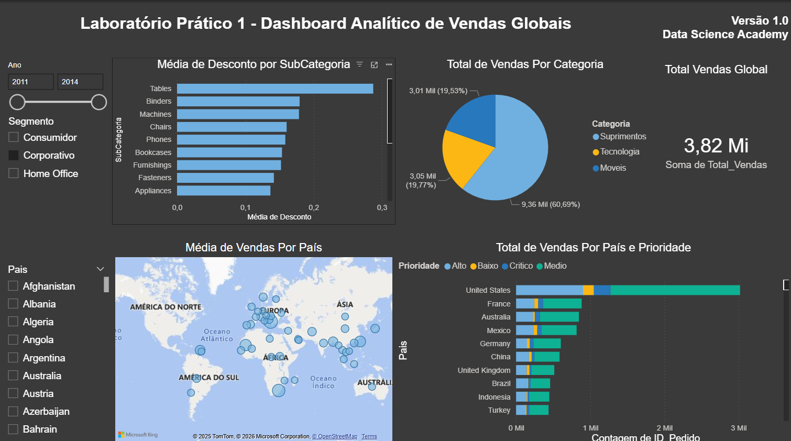

# Laboratório Prático 1

## Dashboard Analítico de Vendas Globais

### Contexto

Projeto desenvolvido durante o curso de Power BI da Data Science Academy com o objetivo de praticar a importação de dados em formato CSV e a construção de um dashboard analítico para apoiar decisões de negócio.

### Objetivo

Criar um dashboard interativo que permita analisar o desempenho de vendas globais e responder a perguntas-chave do negócio por meio de visualizações claras e filtros dinâmicos.

### Perguntas de Negócio Respondidas

- Qual o valor total vendido?
- Quantas vendas foram realizadas por categoria de produto?
- Quantas vendas foram realizadas por país, considerando a prioridade de entrega?
- Qual foi a média de desconto nas vendas por subcategoria de produto?
- Quais países apresentaram a maior média de valor de venda? (visualização em mapa)

### Funcionalidades do Dashboard

- Filtros por **ano**, **segmento** e **país**
- Visualizações para análise comparativa e geográfica
- Indicadores de desempenho (KPIs) para acompanhamento das vendas

### Preview do Dashboard



### Estrutura do Projeto

```
├── dataset.csv                 # Dataset original em CSV
├── dataset.xlsx                # Dataset convertido para Excel
├── Lab1.pbix                   # Relatório desenvolvido no Power BI
├── print-dashboard-cap02.png   # Preview do dashboard
└── README.md                   # Documentação do projeto
```

### Tecnologias Utilizadas

- Power BI
- Arquivos CSV

---

> Projeto desenvolvido durante estudos em análise de dados e Power BI, com base no curso da Data Science Academy, adaptados e documentados para fins de portfólio profissional.

### Referência

- Curso Gratuito de Microsoft Power BI Para Business Intelligence e Data Science – Data Science Academy
  https://www.datascienceacademy.com.br
