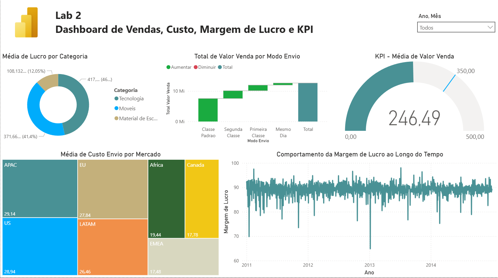

# Laboratório Prático 2

## Dashboard de vendas, custo, margem de lucro e KPI.

### Contexto

Projeto desenvolvido durante o curso de Power BI da Data Science Academy com o objetivo de praticar a importação de dados em formato CSV e a construção de um dashboard analítico para apoiar decisões de negócio.

### Objetivo

Criar um dashboard interativo que permita analisar o desempenho de vendas de uma empresa usando diferentes bases de dados (3 arquivos CSV diferentes) Clientes, Produtos e Pedidos. A partir deles trazer informações importantes sobre o negócio.

### Perguntas de Negócio Respondidas

- Qual foi o total de valor venda considerando cada modo de envio dos pedidos? **(Use um gráfico de cascata)**
- Quais mercados tiveram o maior custo médio de envio dos produtos vendidos? **(Use um gráfico treemap)**
- A empresa tem como objetivo (meta) manter uma média de 350 para o valor de venda todos os meses. Mostre um indicador (KPI–Key Performance Indicator) com o valor médio de venda. **(A empresa ficou abaixo ou acima da meta no mês de Abril/2014?)**
- Considere que o lucro é equivalente a: **`valor venda - custo envio`**. Qual categoria de produto apresentou maior lucro médio.
- Qual foi o comportamento da margem de lucro ao longo do tempo? **(Considere a margem de lucro como o lucro dividido pelo valor venda)**

### Funcionalidades do Dashboard

- Filtros por **ano** e **mês**
- Indicadores de desempenho (KPIs) para acompanhamento das vendas

### Aprendizados

- Criação de KPIs, uso de DAX básico e modelagem simples de dados com múltiplas tabelas.

### Preview do Dashboard



### Estrutura do Projeto

```
├── Clientes.csv                # Dataset de clientes em CSV
├── Pedidos.csv                 # Dataset de pedidos em CSV
├── Produtos.csv                # Dataset de produtos em CSV
├── Lab2.pbix                   # Relatório desenvolvido no Power BI
├── print-dashboard-cap03.png   # Preview do dashboard
└── README.md                   # Documentação do projeto
```

### Tecnologias Utilizadas

- Power BI
- Arquivos CSV

---

> Projeto desenvolvido durante estudos em análise de dados e Power BI, com base no curso da Data Science Academy, adaptados e documentados para fins de portfólio profissional.

### Referência

- Curso Gratuito de Microsoft Power BI Para Business Intelligence e Data Science – Data Science Academy
  https://www.datascienceacademy.com.br
