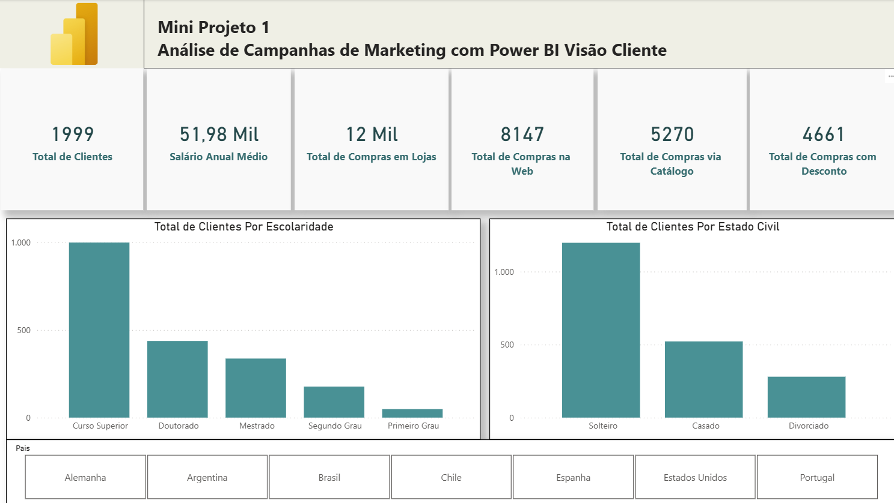
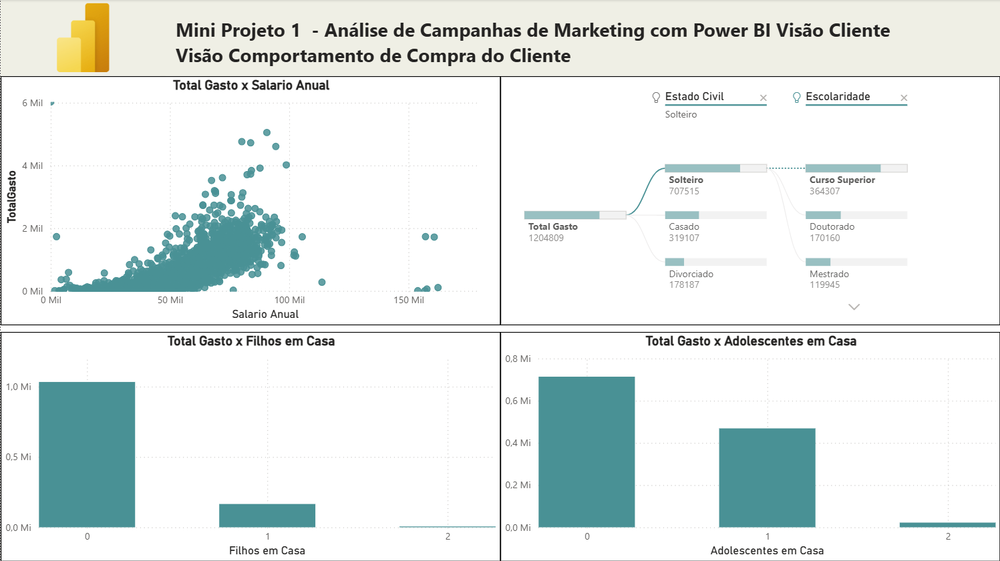
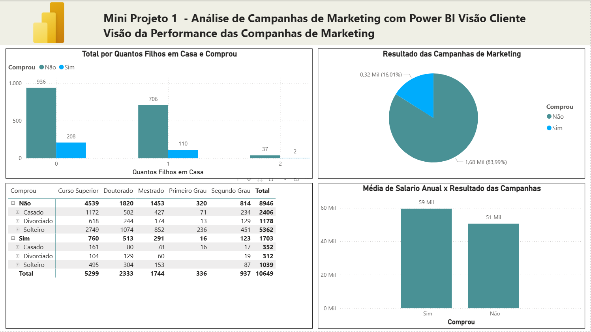
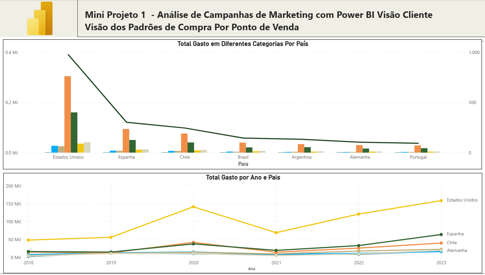

# Mini Projeto 1

## Dashboard Para área de Marketing.

### Contexto

Projeto desenvolvido durante o curso de Power BI da Data Science Academy com o objetivo de praticar a importação de dados em formato CSV e a construção de um dashboard analítico para apoiar decisões de negócio.

### Objetivo

Crie um dashboard com gráficos explorando alguns indicadores da área de marketing.

### Funcionalidades do Dashboard

### Aprendizados

- Criação de abas no power bi e aprender a usar os gráficos de dispersão e árvore hierárquica, álem de melhorar os gráficos de colunas e linhas.

### Preview do Dashboard

#### **Visão Cliente**



#### **Visão Compotamento**



#### **Visão Campanhas**



#### **Visão Ponto de Venda**



### Estrutura do Projeto

```
├── Clientes.csv                # Dataset dados de marketing em CSV
├── mini-projeto1.pbix          # Relatório desenvolvido no Power BI
├── print-dashboard-cap04.png   # Preview do dashboard
└── README.md                   # Documentação do projeto
```

### Tecnologias Utilizadas

- Power BI
- Arquivos CSV

---

> Projeto desenvolvido durante estudos em análise de dados e Power BI, com base no curso da Data Science Academy, adaptados e documentados para fins de portfólio profissional.

### Referência

- Curso Gratuito de Microsoft Power BI Para Business Intelligence e Data Science – Data Science Academy
  https://www.datascienceacademy.com.br
